# CITS3005 IFixIt Knowldge Graph for game consoles

### Heidi Leow (23643117) and James Frayne (23372032)

## Overview

This is a Flask application to explore and manipulate the Game Console data from the [MyFixit-Dataset.](https://github.com/rub-ksv/MyFixit-Dataset) This application consists of multiple parts:

-   requirements.txt PIP packages required to run the application
-   Game Console.json Original data for game consoles from the MyFixit Dataset
-   ontology.py Python script to convert the json data into the ontology.owl file
-   ontology.owl XML OWL file storing the IFixit ontology
-   swrl.txt SWRL rules used to perform logic on the ontology
-   query.py Test script to run SPARQL queries on the ontology
-   shapes.ttl SHACL shapes to validate the ontology against
-   validate.py Test script to run the SHACL validation against the ontology
-   app Flask application contents

## User guide

1. Set up your python virtual environment using `python -m venv .venv`.
2. Activate your virtual environment using `source .venv/bin/activate`, or `.venv/Scripts/activate` if you're on Windows.
3. Install the required packages using `pip install -r requirements.txt`.
4. Install java on your system if it's not already so that the reasoner can run. If on Windows, make sure that you're using 64-bit Java, or the reasoner will be unable to load.
5. Run the application by using `cd app && python web_app.py`. This might take a while to start up- the reasoner needs to run over the ontology.
6. You should now be able to access the application by going to [http://localhost:5000.](http://localhost:5000)

### Searching the knowledge graph

When you open the app, you should see the following page:

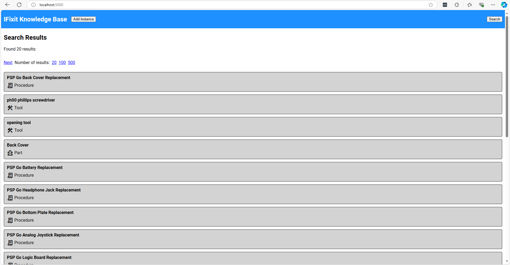

This is the search page without any query present- it will just present assorted items. We can refine this by searching. Let's open the form by pressing the top-right 'Search' button.

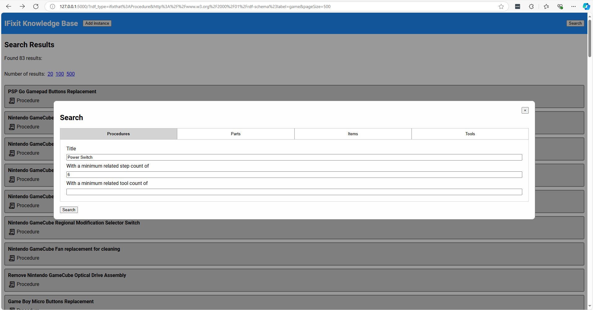

The search form allows you to search through procedures, parts, items, and tools. Each one has a different form, but for our case we'll only search through procedures. This query searches for:
- Forms that have the term 'Power switch' in their name, and
- Forms that have 3 or more steps

We can see the results below:

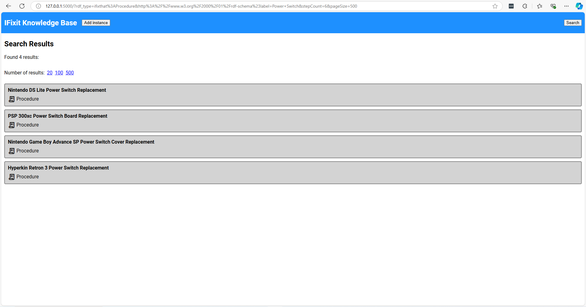

Let's click on 'Hyperkin Retron 3 Power Switch Replacement'.

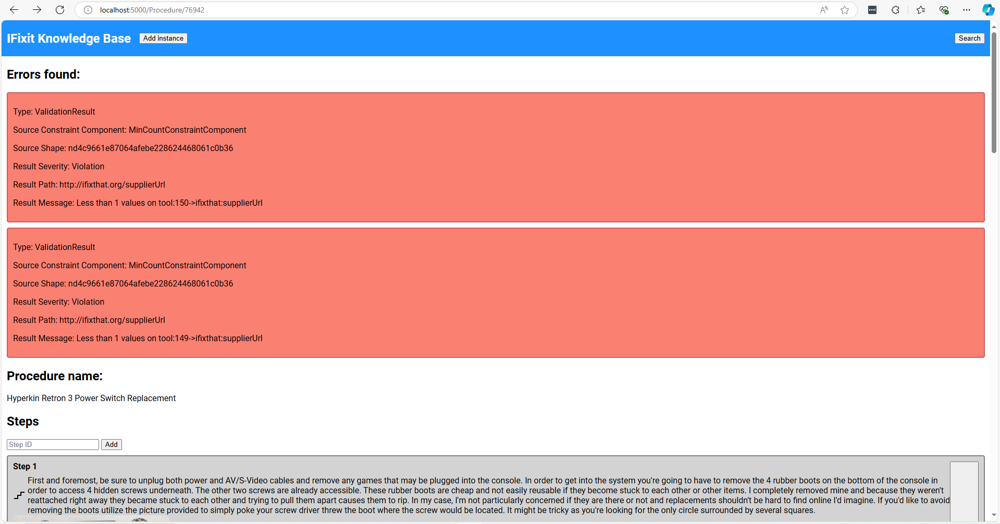

When we view our guide, we can see that PyShacl has detected two errors on this page. The errors claim that there is no value for 'supplierUrl' on tools 149 and 150.

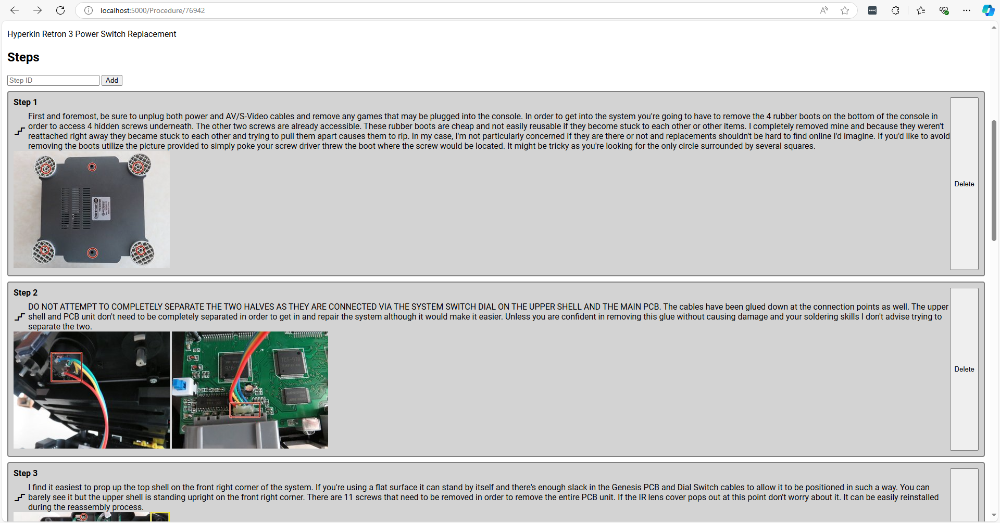

As we scroll down we can see steps that the procedure contains with their images.

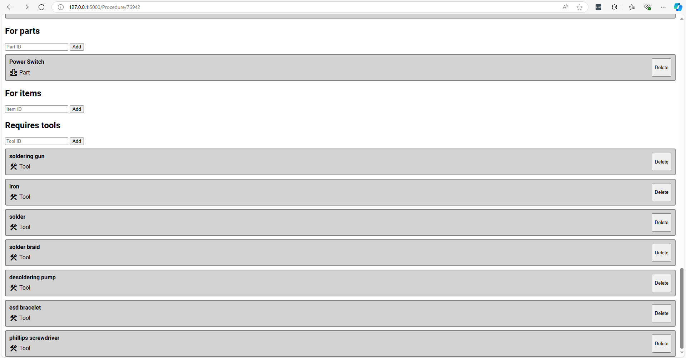

After the steps, we can see what parts, items, and tools this procedure is for. This procedure operates on the 'Power Switch' part (presumably for the Hyperkin Retron 3). We can click on that block to navigate to the part, but we won't do that for now. Instead we can hover the tools to reveal the hovered link (see in bottom left corner) to discover that 'soldering gun' and 'iron' are tools 149 and 150!

### Editing items in the knowledge graph

Let's click on the soldering gun tool to go to it's page:

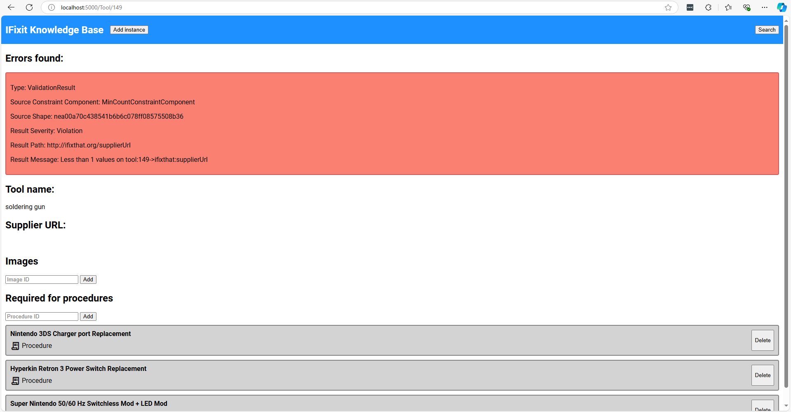

We can see the error is reiterated here, and indeed the supplier URL is empty. Let's adjust it to a URL of our choosing.

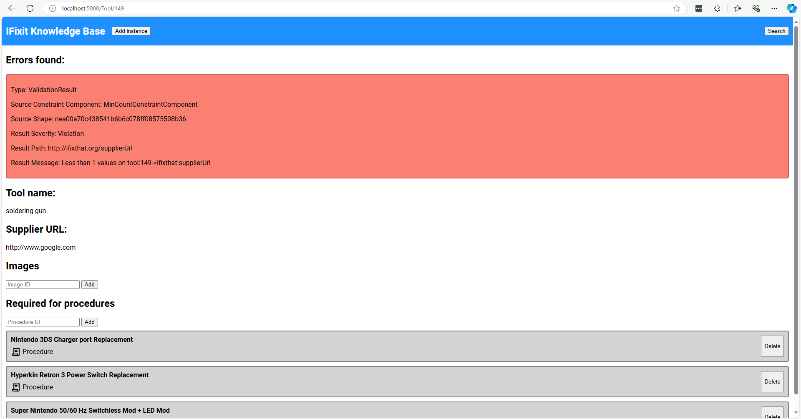

Reloading the page will verify that the changes have persisted. The error will remain until we restart the application- performing a SHACL validation every API query is not feasible for us.

### Deleting items in the knowledge graph

Let's navigate back to our procedure page and deal with the other invalid tool a different way.

Hit the 'delete' button to remove the link to the 'iron' tool.

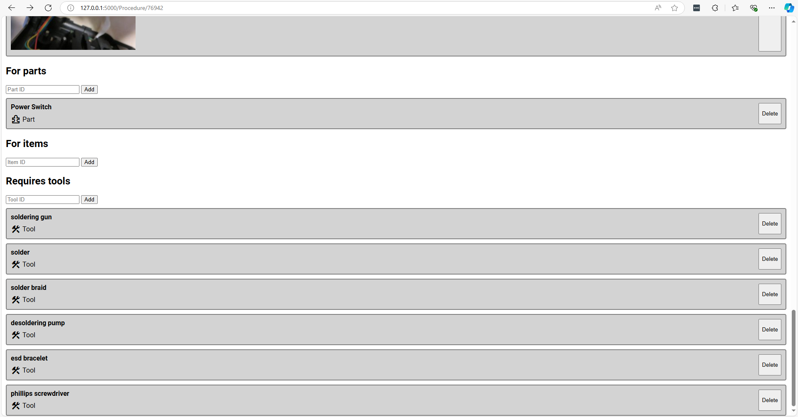

If we restart the application, we can now see that all validation has passed for this procedure!

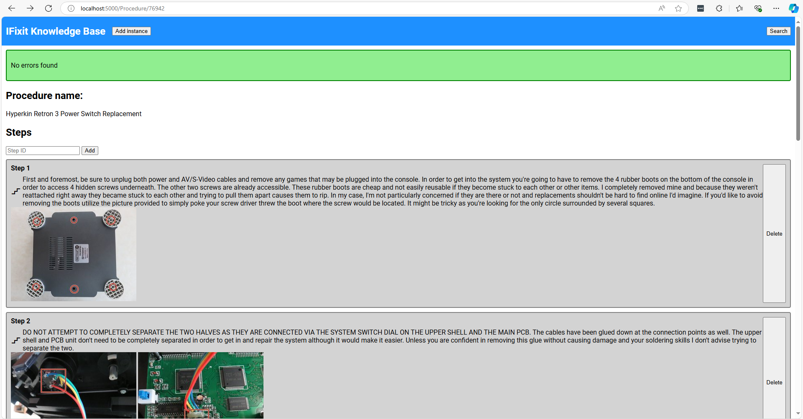

### Adding new items to the knowledge graph

Let's add a new tool to the first step of our procedure. To add a tool, we'll need the id of the tool we're adding. To get the id, we look at the url on a tool view page. We'll add an 'opening tool' as a required tool for the first step of this procedure.

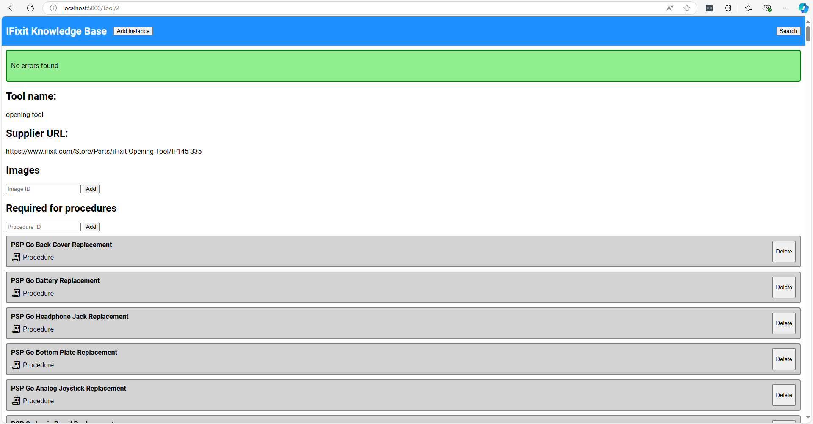

Click on the 'Step 1' link to go to the step, type in the tool id (2) and press 'Add' to add the tool to the step.

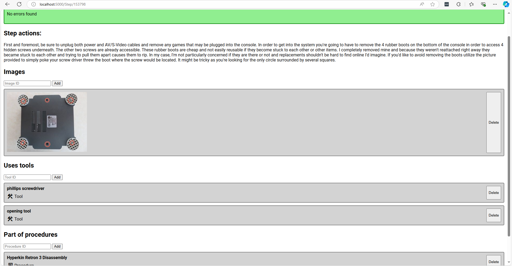

TODO: When SWRL is fixed, navigate back and reload the website and Ta Da! The tool is now listed under the required tools.

### Modifying the ontology
To add new rules to the ontology, add the rule in Conjuctive Normal Form to the swrl.txt file on a single line. The rule will be applied to the reasoner on the next start of the Flask application.

## Ontology structure

### Overview

The following is the structure of the schemas for each entity in the ontology, as well as some examples for each class and property. Each concept has a namespace associated with it.

| Concept   | Description                                                                                                                                      |
| --------- | ------------------------------------------------------------------------------------------------------------------------------------------------ |
| Procedure | A set of steps that describe how to repair or assemble a specific item. Procedures involve tools, parts, and sometimes Images to guide the user. |
| Item      | The primary appliance being repaired or assembled. Items can have parts and sub-items.                                                           |
| Part      | A component of an item that may need to be replaced or repaired.                                                                                 |
| Tool      | An instrument used in a procedure to perform a task. Procedures need tools for certain steps.                                                    |
| Step      | An individual action in a procedure that describes how to perform part of the task.                                                              |
| Image     | Visual documentation associated with a Tool, or possibly to clarify steps within a procedure.                                                    |

#### Procedure schema

| RDF property            | Description                                                  | Example value                                   |
| ----------------------- | ------------------------------------------------------------ | ----------------------------------------------- |
| PROCEDURE:\<id>         | URI representing the Procedure.                              | PROCEDURE#12811                                 |
| RDF.type                | Concept type (always Procedure here)                         | IFIXTHAT.Procedure                              |
| RDFS:label              | The name of the procedure                                    | “New Nintendo 2DS XL Front Buttons Replacement” |
| IFIXTHAT:subProcedureOf | A Procedure for which this Procedure's steps are a subset of | PROCEDURE#62492                                 |
| IFIXTHAT:requiresTool   | A Tool that is needed to complete the Steps of a Procedure   | TOOL:Phillips_00_Screwdriver                    |
| IFIXTHAT:guideOf        | An Item / Part this Procedure is written for                 | PART:New_Nintendo_2DS_XL_Front_Buttons          |
| IFIXTHAT:hasStep        | A Step, with their order in this Procedure's list of Steps   | IFIXTHAT#orderedstep5962                        |

In order to store Steps in an ordered list, an intermediate class was also created, called OrderedStep. It has the Schema:
| RDF property | Description | Example value |
| ---------------- | -------------------------------------------------------------------- | --------------------- |
| IFIXTHAT#\<id> | URI representing the OrderedStep | IFIXTHAT#orderedstep2 |
| RDF.type | Concept type (always OrderedStep here) | IFIXTHAT.OrderedStep |
| IFIXTHAT:details | The Step linked to the order | STEP#6309 |
| IFIXTHAT:order | The index of the step in the corresponding Procedure's list of steps | 1 |

#### Item schema

| RDF property           | Description                                | Example value                           |
| ---------------------- | ------------------------------------------ | --------------------------------------- |
| ITEM#\<id>             | URI representing the Item                  | ITEM#57                                 |
| RDF.type               | Concept type (always Item here)            | IFIXTHAT.Item                           |
| RDFS:label             | The name of the Item                       | "Nintendo WaveBird Wireless Controller" |
| IFIXTHAT:subCategoryOf | An Item which is a superclass of this Item | ITEM#51                                 |

#### Part schema

| RDF property    | Description                              | Example value |
| --------------- | ---------------------------------------- | ------------- |
| PART#\<id>      | URI representing the Part                | PART#355      |
| RDF:type        | Concept type (always Part here)          | IFIXTHAT.Part |
| RDFS:label      | The name of the Part                     | "Buttons"     |
| IFIXTHAT:partOf | An Item for which this Part is a part of | ITEM#57       |

#### Tool schema

| RDF property         | Description                                       | Example value                                                                |
| -------------------- | ------------------------------------------------- | ---------------------------------------------------------------------------- |
| TOOL#\<id>           | URI representing the Tool                         | TOOL#95                                                                      |
| RDF.type             | Concept type (always Tool here)                   | IFIXTHAT.Tool                                                                |
| RDFS:label           | The name of the Tool                              | "essential electronics toolkit"                                              |
| IFIXTHAT:hasImage    | An Image of this Tool                             | IMAGE#2897                                                                   |
| IFIXTHAT:supplierUrl | The url for which this Tool can be found / bought | "https://www.ifixit.com/Store/Tools/Essential-Electronics-Toolkit/IF145-348" |

#### Step schema

| RDF property      | Description                                                          | Example value                                                                                                                                                                                                                                                                                                                                                                                                                                            |
| ----------------- | -------------------------------------------------------------------- | -------------------------------------------------------------------------------------------------------------------------------------------------------------------------------------------------------------------------------------------------------------------------------------------------------------------------------------------------------------------------------------------------------------------------------------------------------- |
| STEP#\<id>        | URI representing the Step                                            | STEP#58074                                                                                                                                                                                                                                                                                                                                                                                                                                               |
| RDF.type          | Concept type (always Step here)                                      | IFIXTHAT.Step                                                                                                                                                                                                                                                                                                                                                                                                                                            |
| IFIXTHAT:hasImage | An Image corresponding to this Step                                  | IMAGE#2902                                                                                                                                                                                                                                                                                                                                                                                                                                               |
| IFIXTHAT:usesTool | A tool that needs to be used in this Step                            | TOOL#2                                                                                                                                                                                                                                                                                                                                                                                                                                                   |
| IFIXTHAT:actions  | The description of actions that need to be carried out for this Step | "Wedge a plastic opening tool into the case-splittings and pull down to crack open the casing near the following buttons: '''Share''' button '''Options''' button Split the plastic covers of the controller apart, taking note that they will still be attached by circuit board ribbons. Three small pieces are often released from the framework. To prevent loss, maintain a controlled work field. 2 Trigger Springs 1 Grey Reset Button Extension" |

#### Image schema

| RDF property     | Description                                   | Example value                                                         |
| ---------------- | --------------------------------------------- | --------------------------------------------------------------------- |
| IMAGE#\<id>      | URI representing the Image                    | Image#2904                                                            |
| RDF.type         | Concept type (always Image here)              | IFIXTHAT.Image                                                        |
| IFIXTHAT.dataURL | The URL location of the Image on the internet | "https://d3nevzfk7ii3be.cloudfront.net/igi/NnxoILTrl2FnxVDa.standard" |

### Building the ontology

### Validating the ontology
